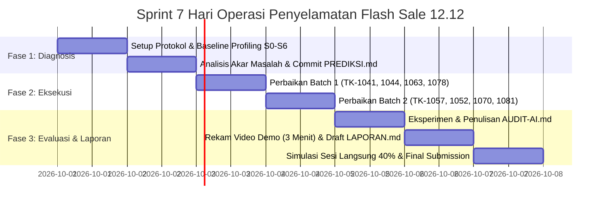

# Rencana Pembagian Tugas Tim TokoKilat (Sprint 1 Minggu)

Rencana kerja akselerasi **1 minggu kalender (7 hari)** untuk tim beranggotakan **4 orang**, menyelesaikan seluruh tiket perbaikan performa Harbolnas 12.12 sesuai ketentuan di [TUGAS.md](file:///Users/nasrulwahid/Downloads/tokokilat/TUGAS.md).

---

## 1. Matriks Peran & Tanggung Jawab Anggota

| Anggota | Peran Spesialisasi | Tiket Masalah | Skenario Uji | Berkas Kode Utama | Tanggung Jawab Luaran Tim |
|---|---|---|---|---|---|
| **Anggota 1** | *Input & Event Loop Specialist* | **TK-1041** & **TK-1057** | **S1**, **S4** | `pencarian.js`<br>`harga-promo.js`<br>`kategori.js`<br>`util.js` | Standardisasi trace baseline DevTools & ekspor berkas trace (`laporan/trace/`) |
| **Anggota 2** | *Interaction & State Specialist* | **TK-1044** & **TK-1052** | **S2**, **S3** | `keranjang.js`<br>`katalog.js` | Penanggung jawab kompilasi laporan utama [laporan/LAPORAN.md](file:///Users/nasrulwahid/Downloads/tokokilat/laporan/LAPORAN.md) & analisis ISO 25010 |
| **Anggota 3** | *Rendering Pipeline Specialist* | **TK-1063** & **TK-1070** | **S5**, **S6** | `gulir.js`<br>`promo.js`<br>`css/toko.css` | Penanggung jawab pengujian usulan AI & penulisan [laporan/AUDIT-AI.md](file:///Users/nasrulwahid/Downloads/tokokilat/laporan/AUDIT-AI.md) |
| **Anggota 4** | *Web Vitals & Loading Specialist* | **TK-1078** & **TK-1081** | **S0** | `index.html`<br>`promo.js`<br>`katalog.js` | Penanggung jawab [laporan/PREDIKSI.md](file:///Users/nasrulwahid/Downloads/tokokilat/laporan/PREDIKSI.md) & Perekaman **Video Demo 3 Menit** |

---

## 2. Rincian Teknis per Anggota

### 👤 Anggota 1: Input Responsiveness & Event Loop Specialist
* **Tiket TK-1041 (Skenario S1)**: *Ketik "sepatu" hurufnya telat muncul, kadang HP hang.*
  * **Akar Masalah**: Event listener input memicu filter dan re-render DOM berulang tanpa *debounce*, serta loop O(n²) di `kategori.js`.
  * **Solusi**: Terapkan *debounce* pada input pencarian, optimasi manipulasi DOM, dan evaluasi loop kategori.
* **Tiket TK-1057 (Skenario S4)**: *Voucher KILAT1212 membuat layar beku lama (0% lalu loncat 100%).*
  * **Akar Masalah**: Perhitungan voucher berjalan sinkron dalam satu blok loop panjang di Main Thread (kata kunci `async` tidak otomatis memecah thread).
  * **Solusi**: Pecah komputasi menjadi *chunks* (menggunakan `scheduler.yield()` atau pembagian task bertahap) agar Event Loop dapat memproses frame render dan ketikan pencarian.
* **Target Metrik**: INP $\le 200\text{ ms}$, tidak ada Long Task $> 100\text{ ms}$ saat interaksi, progres voucher terlihat bertahap.
* **Karakteristik ISO 25010**: *Performance Efficiency - Time Behaviour* & *Interaction Capability - User Engagement*.

---

### 👤 Anggota 2: Interaction Capability & Error Protection Specialist
* **Tiket TK-1044 (Skenario S2)**: *Klik "+ Keranjang" tidak bereaksi, dipencet berkali-kali tahu-tahu isi 3.*
  * **Akar Masalah**: Tidak ada umpan balik visual instan (*optimistic feedback*) saat tombol ditekan.
  * **Solusi**: Berikan *feedback* instan (status ditekan, disable sementara, atau indikator animasi mikro) sebelum proses asinkron selesai.
* **Tiket TK-1052 (Skenario S3)**: *Tagihan 3 pesanan karena tombol "Beli sekarang" diklik berkali-kali.*
  * **Akar Masalah**: Kurangnya perlindungan *idempotency / double-click handling* pada alur checkout.
  * **Solusi**: Nonaktifkan tombol segera setelah klik pertama, tampilkan state "Memproses...", dan pastikan hanya satu permintaan checkout yang dikirim ke server.
* **Target Metrik**: Tepat 1 pesanan dari 3 klik cepat, INP $\le 200\text{ ms}$.
* **Karakteristik ISO 25010**: *Interaction Capability - User Error Protection* & *Operability*.

---

### 👤 Anggota 3: Rendering Pipeline & Compositor Specialist
* **Tiket TK-1063 (Skenario S5)**: *Scroll daftar produk patah-patah / jank.*
  * **Akar Masalah**: Handler scroll memicu *forced synchronous layout* / *layout thrashing* atau listener scroll tidak bertipe `passive`.
  * **Solusi**: Tambahkan opsi `{ passive: true }` pada scroll listener, hindari baca-tulis layout DOM bergantian, gunakan CSS containment (`content-visibility: auto`).
* **Tiket TK-1070 (Skenario S6)**: *HP panas dan baterai cepat habis padahal cuma diam 5 menit.*
  * **Akar Masalah**: Teks promo berjalan atau timer berbasis CPU loop (`setInterval` / animasi non-composited) memicu *repaint* dan *reflow* terus-menerus di Main Thread.
  * **Solusi**: Migrasikan animasi teks berjalan ke Compositor Thread menggunakan CSS `transform` / `opacity`, hentikan timer saat idle/tidak terlihat.
* **Target Metrik**: Frame $> 50\text{ ms}$ maksimal 2 per 10 detik, aktivitas Main Thread saat diam mendekati $0\%$.
* **Karakteristik ISO 25010**: *Performance Efficiency - Resource Utilization* & *Operability*.

---

### 👤 Anggota 4: Web Vitals & Loading Performance Specialist
* **Tiket TK-1078 (Skenario S0)**: *Mau klik produk paling atas, halaman meloncat turun ke iklan promo.*
  * **Akar Masalah**: Kontainer banner promo dimuat asinkron tanpa reservasi dimensi/aspek rasio, menyebabkan *Cumulative Layout Shift* (CLS).
  * **Solusi**: Tetapkan dimensi eksplisit atau `aspect-ratio` / `min-height` pada wadah banner di CSS agar tidak menggeser elemen di bawahnya.
* **Tiket TK-1081 (Skenario S0)**: *Gambar abu-abu lama muncul saat scroll cepat, kuota boros.*
  * **Akar Masalah**: Seluruh gambar produk diunduh sekaligus di awal (*eager loading*), menghabiskan *network bandwidth* dan memori.
  * **Solusi**: Implementasikan *native lazy loading* (`loading="lazy"`) atau `IntersectionObserver` agar gambar dimuat hanya saat mendekati *viewport*.
* **Target Metrik**: CLS $\le 0.1$, jumlah request gambar di awal sebanding dengan kartu di layar (bukan ribuan).
* **Karakteristik ISO 25010**: *Performance Efficiency - Capacity* & *Interaction Capability - Inclusivity*.

---

## 3. Jadwal Kerja Harian (Timeline 7 Hari)



### 📅 Hari 1: Setup Lingkungan & Baseline Profiling
* Setiap anggota mengonfigurasi Chrome DevTools sesuai protokol:
  * Jendela Incognito, Viewport **412 x 915**, **CPU 4x Slowdown**.
  * URL: `http://localhost:3000/?ukur=1`.
* Rekam data awal untuk Skenario **S0 sampai S6** (ulangi 3 kali, ambil nilai **median**).
* Simpan file trace baseline awal ke folder `laporan/trace/baseline/` (dipimpin Anggota 1).

### 📅 Hari 2: Analisis Akar Masalah & Commit PREDIKSI.md
* Setiap anggota membedah flame chart tiketnya masing-masing:
  * Tentukan apakah waktu habis di task/microtask atau tahap pipeline (Style/Layout/Paint).
  * Bandingkan dengan catatan serah terima Rudi (apakah benar atau mitos).
* **WAJIB**: Setiap anggota menuliskan hipotesis perbaikan di [laporan/PREDIKSI.md](file:///Users/nasrulwahid/Downloads/tokokilat/laporan/PREDIKSI.md) lalu **di-commit ke Git sebelum kode diperbaiki**.

### 📅 Hari 3: Perbaikan Kode Batch 1 & Pengukuran
* Pengerjaan tiket tahap pertama:
  * Anggota 1: Perbaikan pencarian `pencarian.js` (TK-1041).
  * Anggota 2: Perbaikan feedback keranjang `keranjang.js` (TK-1044).
  * Anggota 3: Perbaikan scroll jank `gulir.js` (TK-1063).
  * Anggota 4: Perbaikan CLS banner promo `index.html` & `css/toko.css` (TK-1078).
* Ukur ulang dengan protokol yang sama, pastikan tidak ada regresi fungsional. Lakukan commit Git terpisah per tiket.

### 📅 Hari 4: Perbaikan Kode Batch 2 & Pengukuran
* Pengerjaan tiket tahap kedua:
  * Anggota 1: Chunking perhitungan voucher `harga-promo.js` (TK-1057).
  * Anggota 2: Proteksi pesanan ganda / checkout `keranjang.js` (TK-1052).
  * Anggota 3: Optimasi animasi teks promo & idle CPU `promo.js` (TK-1070).
  * Anggota 4: Lazy loading gambar katalog `katalog.js` (TK-1081).
* Ekspor rekaman trace sesudah perbaikan ke folder `laporan/trace/perbaikan/`.

### 📅 Hari 5: Eksperimen Audit AI (AUDIT-AI.md)
* Minta AI memberikan usulan perbaikan untuk minimal dua tiket di branch uji coba terpisah.
* Anggota 3 memimpin verifikasi: temukan **minimal 2 kelemahan** dari usulan AI (usulan yang salah, tidak berdampak, atau menimbulkan regresi).
* Lampirkan bukti rekaman trace perbandingan dan lengkapi [laporan/AUDIT-AI.md](file:///Users/nasrulwahid/Downloads/tokokilat/laporan/AUDIT-AI.md).

### 📅 Hari 6: Pembuatan Video Demo & Draft Laporan Akhir
* **Anggota 4**: Merekam video demo berdurasi maksimal **3 menit** (kondisi CPU 4x slowdown) yang menampilkan perbandingan sebelum vs sesudah untuk Skenario S1–S5.
* **Anggota 2**: Mengompilasi seluruh tabel data sebelum vs sesudah dan narasi ISO 25010 ke [laporan/LAPORAN.md](file:///Users/nasrulwahid/Downloads/tokokilat/laporan/LAPORAN.md).
* Seluruh anggota mereviu angka median akhir tiket masing-masing.

### 📅 Hari 7: Simulasi Sesi Langsung (40%) & Pengumpulan
* **Simulasi Internal (Dry Run)**:
  * Luangkan waktu 1–2 jam di mana setiap anggota saling menguji membaca *flame chart* rekan lainnya selama 5–10 menit.
  * Pastikan semua anggota memahami alur Event Loop dan Rendering Pipeline seluruh repositori, bukan hanya tiket yang dikerjakannya.
* Pastikan branch `main` bersih, riwayat commit rapi, dan dorong semua commit akhir ke GitHub:
  ```bash
  git push origin main
  ```

---

## 4. Checklist Aturan Main (Do's & Don'ts)

- [ ] **DILARANG MENGUBAH**: `server.js`, `public/vendor/`, dan `public/alat/`.
- [ ] **DILARANG MENGGUNAKAN LIBRARY / FRAMEWORK**: Hanya HTML, CSS, JavaScript murni (Web APIs).
- [ ] **FITUR TIDAK BOLEH HILANG**: Seluruh produk, hitung mundur, banner, voucher, dan keranjang harus tetap berfungsi utuh.
- [ ] **ATURAN COMMIT**: Tulis dan commit hipotesis di [laporan/PREDIKSI.md](file:///Users/nasrulwahid/Downloads/tokokilat/laporan/PREDIKSI.md) **sebelum** commit kode perbaikan.
